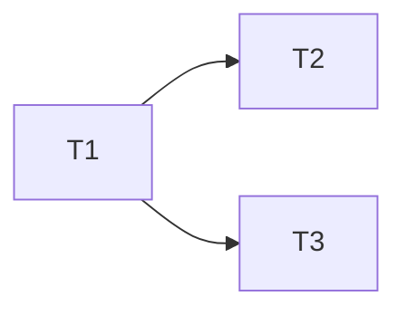

# Task Decomp Fan-Out Skill

> **何时调用**：T3 任务包拆分 · 五件套（spec / plan / data-model / contracts / quickstart）全 Approved 后。
> **权威**：playbook。

## 输入
1. `specs/<feature-id>/plan.md`（Approved · 含选定方案）
2. `specs/<feature-id>/contracts/*.yaml`
3. `specs/<feature-id>/quickstart.md`（自验场景 ≥ 3）

## 步骤
1. **从 plan + contracts 抽 Task**：每个 Task 是 1-3 天可完成的最小独立交付单元
2. **填 tasks.md**（每行一个 task）：`task-id | 标题 | 依赖 task-ids | 关联 contract | 预估 (人天) | DoD（≤3 条）`
3. **依赖图**：mermaid graph 画出 task 间 DAG，禁出现环
4. **派生 Issue**：`/speckit.taskstoissues` 或等价脚本，N 行 → N 个 Issue，每个 Issue body 自动注入 Context Bundle

## 输出落点
```
specs/<feature-id>/
├── tasks.md            ← N 行 task + 依赖图
└── _issues-map.md      ← task-id ↔ GitHub Issue # 映射（脚本自动写）
```

## Task 颗粒红线

- **不允许跨 BC 的 Task**（违反 → 拆分）
- **不允许跨 contract version 的 Task**（违反 → 拆分）
- **DoD ≤ 3 条**（>3 → 任务太大，拆）

## Gate（进 T4）

- Issue # 齐全 · 依赖图无环 · 每个 Task 关联到具体 contract 锚点 + quickstart 场景

## 与 playbook 任务拆分原则的关系

- Feature 共享 spec / plan / data-model / contracts / quickstart（**不动**）
- Task 各自落在 issue body 展开（**新增**），缺漏回流 Feature 级 spec

## Worked Example

**Input**
```
/task-decomp-fanout 042-<feature>
prerequisites: 5 件套全 Approved
```

**Output** (`specs/042-<feature>/tasks.md` 片段)
```markdown
| id | 标题 | 依赖 | contract | 估工 | DoD |
|----|------|------|----------|------|-----|
| T1 | 建表与 migration | -  | data-model.md#L20 | 1d | migration apply 成功 |
| T2 | 实现 GET 列表 | T1 | <bctx>.yaml#listEntities | 1d | quickstart 场景 1 通过 |
| T3 | 实现 POST 创建 | T1 | <bctx>.yaml#createEntity | 2d | quickstart 场景 2 通过 |

```
